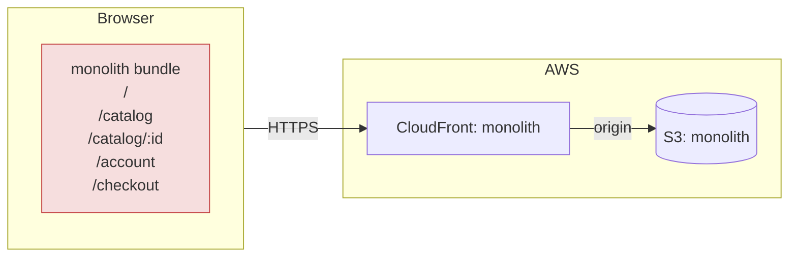
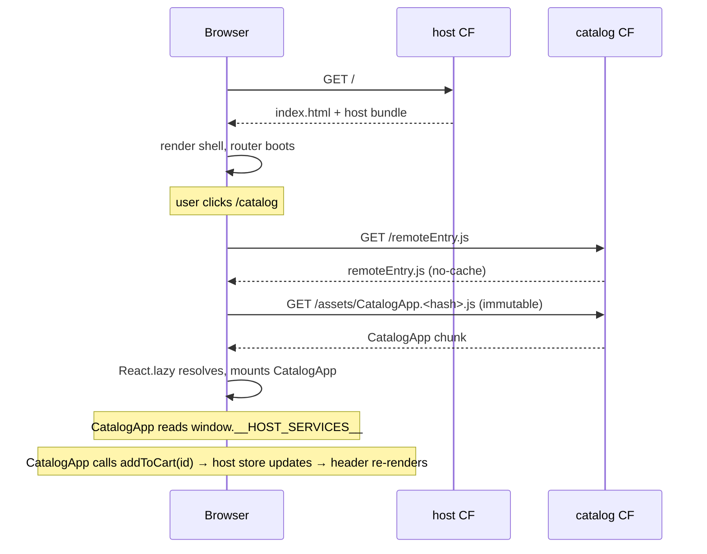
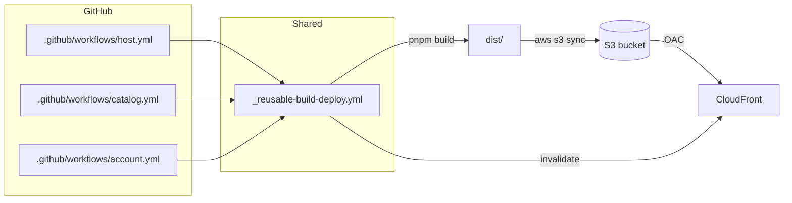

# Architecture

Living document. Students update the **target** sections as they work.

---

## Current state (monolith)

Single React SPA. One bundle, one pipeline, one deploy target.



Pain points:

- One build for any change — a typo fix in `Header` rebuilds the whole app.
- One deploy — catalog's hotfix ships account's half-finished experiment.
- One ownership surface — three teams edit the same `Header.tsx`.
- Internal coupling (ProductCard directly mutates the cart store) makes
  extracting any domain painful.

---

## Target state (microfrontends via Module Federation)

Three independent bundles. Host loads remotes at runtime.

```mermaid
flowchart TB
  subgraph Browser
    H[host bundle<br/>shell + router + cart + checkout]
    H -. fetch remoteEntry.js .-> C[catalog remote<br/>CatalogApp]
    H -. fetch remoteEntry.js .-> A[account remote<br/>AccountApp]
    H -. reads .-> W[[window.__HOST_SERVICES__]]
    C -. reads .-> W
    A -. reads .-> W
  end

  subgraph AWS
    direction LR
    subgraph HostSite
      HS[(S3: host)]
      HCF[CloudFront: host]
    end
    subgraph CatalogSite
      CS[(S3: catalog)]
      CCF[CloudFront: catalog]
    end
    subgraph AccountSite
      AS[(S3: account)]
      ACF[CloudFront: account]
    end
  end

  Browser --https--> HCF --> HS
  Browser --https--> CCF --> CS
  Browser --https--> ACF --> AS

  style H fill:#d6e4ff,stroke:#2b5cff
  style C fill:#dcefe3,stroke:#2c9f5a
  style A fill:#fdeccd,stroke:#c78200
```

Key properties:

- **Host** is the only origin the user navigates to. It serves `index.html`
  and the shell JS; the browser then fetches each remote's `remoteEntry.js`
  on demand.
- **Remotes** are private domains that only the host calls. They need
  `Access-Control-Allow-Origin` to allow it.
- **Routing** is all client-side react-router: `/catalog/*` mounts the
  catalog remote, `/account/*` mounts the account remote. The host does
  not proxy — it composes.
- **Independent CI.** Each app has its own pipeline and deploys only its
  bucket+distribution.

---

## Load sequence



---

## Contracts

### `HostServices` (host → remotes)

Defined in `packages/types/src/index.ts`. Injected by the host onto
`window.__HOST_SERVICES__` before any remote mounts. Read by remotes via
`getHostServices()`.

```ts
interface HostServices {
  session: {
    user: { id; email; name; tier } | null;
    isAuthenticated: boolean;
  };
  addToCart: (productId: string, quantity?: number) => void;
  cartCount: number;
}
```

**Versioning rule:** additive-only. Removing or narrowing a field is a
breaking change and must be coordinated across all deploys (deploy remotes
first, then host — or introduce a new field and remove the old one in a
later release).

### Routing contract (host → remotes)

- Host owns: `/`, `/checkout`, everything that doesn't match a remote prefix.
- `/catalog/*` is delegated to catalog's `CatalogApp`. Its internal routes
  use *relative* paths.
- `/account/*` is delegated to account's `AccountApp`.
- Remotes must never render `<a href="/">` with an absolute path that
  escapes their mount point without going through the host's router.

### Data ownership

| Data         | Owner    | Rationale                                      |
|--------------|----------|------------------------------------------------|
| Session/User | host     | Single source of truth, mirrored to remotes.   |
| Cart         | host     | Aggregates across remotes; lives where Checkout lives. |
| Products     | catalog  | Catalog's domain.                              |
| Orders       | account  | Account's domain.                              |
| Feature flags| host     | Single source; propagated to remotes via `HostServices`. |

No cross-remote data imports are allowed. If Account needs a product
title to render an order line, either:
- Account stores a denormalized snapshot at order-creation time, or
- the host exposes a `lookupProduct(id)` function via `HostServices`.

Preferred: the first. Denormalizing the order line is cheap and avoids
coupling.

---

## Deployment topology



---

## Cache policy

| Path                    | Cache-Control                             | Why                              |
|-------------------------|-------------------------------------------|----------------------------------|
| `/index.html`           | `no-cache`                                | Must always see fresh chunk URLs |
| `/remoteEntry.js`       | `no-cache`                                | Must always see fresh chunks     |
| `/assets/*.[hash].js`   | `public, max-age=31536000, immutable`     | Hash guarantees uniqueness       |
| `/img/*.svg`            | `public, max-age=31536000, immutable`     | Static assets                    |

---

## CORS

The host is on one CloudFront domain; each remote is on another. The host's
browser will refuse to execute `remoteEntry.js` from a different origin
unless that origin sends `Access-Control-Allow-Origin`. In dev we set `*`;
in prod we scope to the host's domain only.

---

## Failure modes

| Failure                          | Blast radius                   | Detection                       | Recovery                         |
|----------------------------------|--------------------------------|---------------------------------|----------------------------------|
| Catalog `remoteEntry.js` 404s    | Only `/catalog/*`              | `RemoteBoundary` fallback       | Roll back catalog                |
| Catalog chunk mismatch (stale `remoteEntry.js`) | Users mid-load | Console errors, user reports    | Fixed by `no-cache` on `remoteEntry.js` |
| React version mismatch           | Whole app, hooks break         | "Invalid hook call" in console  | Pin `requiredVersion` exact, rebuild |
| Host is down                     | Entire site                    | Pingdom on host domain          | Roll back host                   |
| `@mf/types` breaking change      | Type errors, or runtime `undefined` | CI catches types; runtime catches undefined | Additive-only rule; feature-flag new fields |

---

## What I'd do differently in a real 50-dev org

*(Students fill this in as the last paragraph of their solution.)*
