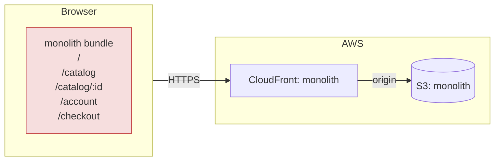
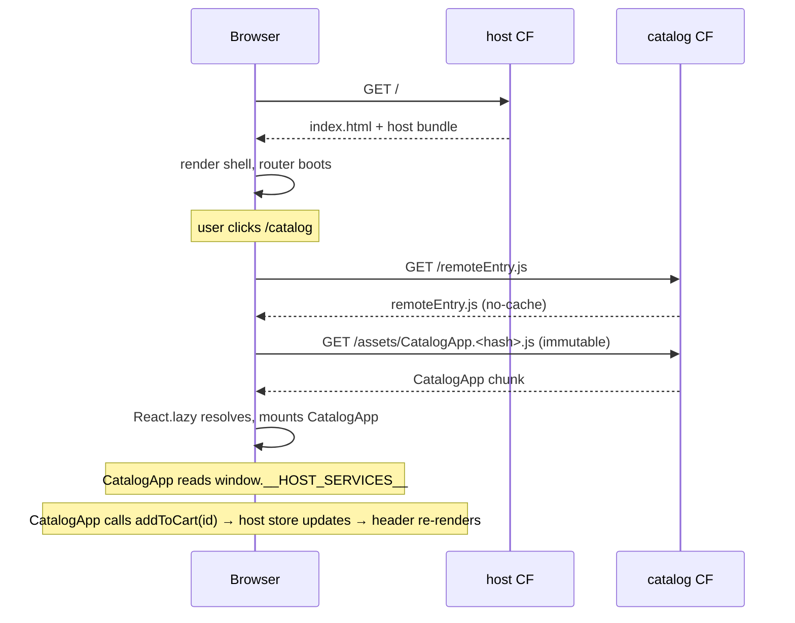
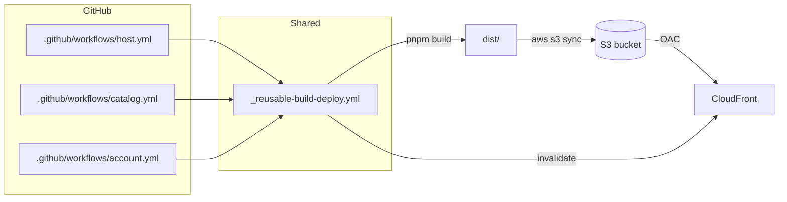

# Architecture

Living document. Students update the **target** sections as they work.

---

## Current state (monolith)

Single React SPA. One bundle, one pipeline, one deploy target.



Pain points:

- One build for any change — a typo fix in `Header` rebuilds the whole app.
- One deploy — catalog's hotfix ships account's half-finished experiment.
- One ownership surface — three teams edit the same `Header.tsx`.
- Internal coupling (ProductCard directly mutates the cart store) makes
  extracting any domain painful.

---

## Target state (microfrontends via Module Federation)

Three independent bundles. Host loads remotes at runtime.

```mermaid
flowchart TB
  subgraph Browser
    H[host bundle<br/>shell + router + cart + checkout]
    H -. fetch remoteEntry.js .-> C[catalog remote<br/>CatalogApp]
    H -. fetch remoteEntry.js .-> A[account remote<br/>AccountApp]
    H -. reads .-> W[[window.__HOST_SERVICES__]]
    C -. reads .-> W
    A -. reads .-> W
  end

  subgraph AWS
    direction LR
    subgraph HostSite
      HS[(S3: host)]
      HCF[CloudFront: host]
    end
    subgraph CatalogSite
      CS[(S3: catalog)]
      CCF[CloudFront: catalog]
    end
    subgraph AccountSite
      AS[(S3: account)]
      ACF[CloudFront: account]
    end
  end

  Browser --https--> HCF --> HS
  Browser --https--> CCF --> CS
  Browser --https--> ACF --> AS

  style H fill:#d6e4ff,stroke:#2b5cff
  style C fill:#dcefe3,stroke:#2c9f5a
  style A fill:#fdeccd,stroke:#c78200
```

Key properties:

- **Host** is the only origin the user navigates to. It serves `index.html`
  and the shell JS; the browser then fetches each remote's `remoteEntry.js`
  on demand.
- **Remotes** are private domains that only the host calls. They need
  `Access-Control-Allow-Origin` to allow it.
- **Routing** is all client-side react-router: `/catalog/*` mounts the
  catalog remote, `/account/*` mounts the account remote. The host does
  not proxy — it composes.
- **Independent CI.** Each app has its own pipeline and deploys only its
  bucket+distribution.

---

## Load sequence



---

## Contracts

### `HostServices` (host → remotes)

Defined in `packages/types/src/index.ts`. Injected by the host onto
`window.__HOST_SERVICES__` before any remote mounts. Read by remotes via
`getHostServices()`.

```ts
interface HostServices {
  session: {
    user: { id; email; name; tier } | null;
    isAuthenticated: boolean;
  };
  addToCart: (productId: string, quantity?: number) => void;
  cartCount: number;
}
```

**Versioning rule:** additive-only. Removing or narrowing a field is a
breaking change and must be coordinated across all deploys (deploy remotes
first, then host — or introduce a new field and remove the old one in a
later release).

### Routing contract (host → remotes)

- Host owns: `/`, `/checkout`, everything that doesn't match a remote prefix.
- `/catalog/*` is delegated to catalog's `CatalogApp`. Its internal routes
  use *relative* paths.
- `/account/*` is delegated to account's `AccountApp`.
- Remotes must never render `<a href="/">` with an absolute path that
  escapes their mount point without going through the host's router.

### Data ownership

| Data         | Owner    | Rationale                                      |
|--------------|----------|------------------------------------------------|
| Session/User | host     | Single source of truth, mirrored to remotes.   |
| Cart         | host     | Aggregates across remotes; lives where Checkout lives. |
| Products     | catalog  | Catalog's domain.                              |
| Orders       | account  | Account's domain.                              |
| Feature flags| host     | Single source; propagated to remotes via `HostServices`. |

No cross-remote data imports are allowed. If Account needs a product
title to render an order line, either:
- Account stores a denormalized snapshot at order-creation time, or
- the host exposes a `lookupProduct(id)` function via `HostServices`.

Preferred: the first. Denormalizing the order line is cheap and avoids
coupling.

---

## Deployment topology



---

## Cache policy

| Path                    | Cache-Control                             | Why                              |
|-------------------------|-------------------------------------------|----------------------------------|
| `/index.html`           | `no-cache`                                | Must always see fresh chunk URLs |
| `/remoteEntry.js`       | `no-cache`                                | Must always see fresh chunks     |
| `/assets/*.[hash].js`   | `public, max-age=31536000, immutable`     | Hash guarantees uniqueness       |
| `/img/*.svg`            | `public, max-age=31536000, immutable`     | Static assets                    |

---

## CORS

The host is on one CloudFront domain; each remote is on another. The host's
browser will refuse to execute `remoteEntry.js` from a different origin
unless that origin sends `Access-Control-Allow-Origin`. In dev we set `*`;
in prod we scope to the host's domain only.

---

## Failure modes

| Failure                          | Blast radius                   | Detection                       | Recovery                         |
|----------------------------------|--------------------------------|---------------------------------|----------------------------------|
| Catalog `remoteEntry.js` 404s    | Only `/catalog/*`              | `RemoteBoundary` fallback       | Roll back catalog                |
| Catalog chunk mismatch (stale `remoteEntry.js`) | Users mid-load | Console errors, user reports    | Fixed by `no-cache` on `remoteEntry.js` |
| React version mismatch           | Whole app, hooks break         | "Invalid hook call" in console  | Pin `requiredVersion` exact, rebuild |
| Host is down                     | Entire site                    | Pingdom on host domain          | Roll back host                   |
| `@mf/types` breaking change      | Type errors, or runtime `undefined` | CI catches types; runtime catches undefined | Additive-only rule; feature-flag new fields |

---

## Rollback strategy

If a broken build reaches production, we have two rollback mechanisms.
Both rely on a key property of our deployment pipeline: **two-phase sync**
(see `_reusable-build-deploy.yml`).

### Two-phase sync (why order matters)

```text
Phase 1 — upload hashed chunks
  aws s3 sync ... --exclude "index.html" --exclude "remoteEntry.js"
                  --cache-control "public, max-age=31536000, immutable"

Phase 2 — upload entry files
  aws s3 sync ... --include "index.html" --include "remoteEntry.js"
                  --cache-control "no-cache"
```

New chunks (with a new hash in the filename) are uploaded **before**
`index.html` starts referencing them. This means:

- A user who opened the site **before** deployment sees the old `index.html` →
  downloads old chunks (they still exist in the bucket).
- A user who opens the site **after** deployment sees the new `index.html` →
  downloads new chunks (they were already uploaded in Phase 1).
- The race-condition window where a 404 could occur (old `index.html` +
  missing chunks) is virtually zero.

### Mechanism 1: Git SHA Redeploy (standard)

1. Navigate to **GitHub Actions → workflow → Run workflow**.
2. Select the branch or commit SHA representing the last known-good state.
3. The pipeline rebuilds the code from that SHA (deterministic build).
4. Phase 1 re-uploads the "old" chunks to S3.
5. Phase 2 overwrites `index.html` / `remoteEntry.js` with the previous versions.
6. CloudFront Invalidation (`/index.html`, `/remoteEntry.js`, `/`) flushes
   the cache across all edge locations.
7. The next user request receives the restored version.

**Rollback time:** ~2–3 minutes (build + sync + invalidation propagation).

### Mechanism 2: S3 Object Versioning (emergency, no rebuild)

Terraform enables `versioning` on every bucket
(`infra/modules/static-site/main.tf`, resource `aws_s3_bucket_versioning`).
This means S3 stores **all previous versions** of every object.

Emergency rollback without CI/CD:

```bash
# 1. Find the version-id of the previous index.html
aws s3api list-object-versions \
  --bucket mf-sandbox-catalog-dev \
  --prefix index.html \
  --max-keys 5

# 2. Restore a specific version (copy it over the current one)
aws s3api copy-object \
  --bucket mf-sandbox-catalog-dev \
  --copy-source "mf-sandbox-catalog-dev/index.html?versionId=<PREV_VERSION_ID>" \
  --key index.html \
  --cache-control "no-cache"

# 3. Invalidate CloudFront cache
aws cloudfront create-invalidation \
  --distribution-id E3NTDORYTZ7T7Q \
  --paths "/index.html" "/remoteEntry.js" "/"
```

**Rollback time:** ~30 seconds + invalidation propagation. Requires no
rebuild and no GitHub access. Ideal for critical production incidents.

### Why `aws s3 sync --delete` is safe

The `--delete` flag removes files from the bucket that are absent in the
current build (i.e., old chunks). This is safe for two reasons:

1. Hashed chunks are unique — a new build produces files with new hashes.
   Old chunks are no longer referenced once `index.html` is updated.
2. If a user is stuck on an old `index.html` and requests a deleted chunk,
   the `RemoteBoundary` (Error Boundary) catches the resulting 404 and
   displays a fallback UI instead of a blank screen.

---

## Service discovery (Dynamic Remotes)

### Current implementation (static)

Currently, the host discovers remote URLs via environment variables that
Webpack bakes into the bundle at build time:

```js
// webpack.config.ts (host)
new ModuleFederationPlugin({
  remotes: {
    catalog: `catalog@${process.env.CATALOG_URL}/remoteEntry.js`,
    account: `account@${process.env.ACCOUNT_URL}/remoteEntry.js`,
  },
})
```

The variables `CATALOG_URL` and `ACCOUNT_URL` come from GitHub Variables
(`vars.CATALOG_URL_DEV`) and are injected during the `pnpm build` step in CI.

**The problem:** If we want to change the catalog domain (e.g., move it to a
different CloudFront distribution or region), we must:

1. Update the GitHub Variable.
2. Rebuild and redeploy the **host**, even though its code hasn't changed.

This violates the principle of independent deployment.

### Target architecture (dynamic)

Instead of static build-time injection, the host should discover remote
addresses **on every page load**:

```text
Browser → GET /config/remotes.json → { catalog: "https://d3ek...net", account: "https://d2zd...net" }
       → GET catalog_url/remoteEntry.js
       → mount CatalogApp
```

#### Step 1: The manifest

Create a JSON file `remotes.json` and store it in a dedicated S3 bucket
(or in SSM Parameter Store):

```json
{
  "catalog": {
    "url": "https://d3ekdye2vts754.cloudfront.net",
    "module": "./CatalogApp"
  },
  "account": {
    "url": "https://d2zdr2f6y6od3k.cloudfront.net",
    "module": "./AccountApp"
  }
}
```

#### Step 2: Dynamic loading

The host fetches the manifest **before** React begins rendering:

```ts
// src/lib/dynamic-remotes.ts
export async function loadRemoteManifest(): Promise<RemoteManifest> {
  const res = await fetch("/config/remotes.json");
  return res.json();
}

export async function loadRemoteModule(
  manifest: RemoteManifest,
  remoteName: string
) {
  const entry = manifest[remoteName];

  // Dynamically initialize and load remoteEntry.js
  await __webpack_init_sharing__("default");
  const container = await import(/* webpackIgnore: true */ `${entry.url}/remoteEntry.js`);
  await container.init(__webpack_share_scopes__.default);

  // Extract the requested module
  const factory = await container.get(entry.module);
  return factory();
}
```

#### Step 3: Updating without a host redeploy

To change the catalog domain, simply update the manifest:

```bash
aws ssm put-parameter --name "/mf/dev/catalog-url" \
  --value "https://new-catalog-domain.cloudfront.net" --overwrite
```

The host reads the new address on the next page load. No host code changed,
no host pipeline was triggered.

---

## What I'd do differently in a real 50-dev org

In a scale-up scenario with 50+ developers across 8–10 teams, the current
monorepo + Module Federation setup would face significant bottlenecks. Below
is a detailed breakdown of what I would change and why.

### 1. Contract Testing & Type Safety

**Problem:** Today we share a `packages/types` folder inside the monorepo.
Any developer can edit `HostServices`, push to `main`, and accidentally break
every remote that depends on the old shape — with zero compile-time warning
for already-deployed remotes.

**Solution:**

- Publish `@mf/types` to an **internal npm registry** (e.g., GitHub Packages
  or AWS CodeArtifact) with strict **semantic versioning**.
- Introduce **contract testing** using [Pact](https://pact.io/) or a similar
  tool. Each remote writes a "consumer contract" describing the shape of
  `HostServices` it expects. The host's CI validates all consumer contracts
  before merging.
- Enforce an **additive-only rule** at the CI level: a linter or custom
  script that compares the current `HostServices` interface against the
  previous published version and rejects removals or type narrowings.

```text
Remote CI (consumer):
  1. Generate Pact contract from HostServices usage
  2. Publish contract to Pact Broker

Host CI (provider):
  1. Pull all consumer contracts from Pact Broker
  2. Verify host implementation satisfies every contract
  3. Block merge if any contract is broken
```

### 2. Shared UI Library Strategy

**Problem:** Lifting components into `@mf/ui` and expecting Module Federation
to deduplicate them at runtime is fragile. A version mismatch in a shared
Button component can cause subtle rendering bugs that are invisible until
production.

**Solution:**

- Package the design system as a **standard npm module** (`@acme/design-system`),
  versioned independently with its own CI pipeline.
- Each microfrontend **pins a specific version** in its `package.json` and
  bundles its own copy. This eliminates runtime version conflicts.
- Use **visual regression testing** (e.g., Chromatic or Percy) in the design
  system's CI to catch unintended visual changes before publishing a new
  version.
- Adopt a **rolling upgrade strategy**: when a new design system version ships,
  teams upgrade at their own pace. The host and remotes can temporarily run
  different versions without breaking — the user sees a consistent UI as long
  as the differences are backward-compatible.

### 3. Dynamic Remotes & Canary Deployments

**Problem:** Currently, remote URLs are baked into the host at build time.
Deploying a new version of a remote is all-or-nothing — 100% of users get the
new code instantly. If it's broken, 100% of users are affected.

**Solution:**

- Implement the **runtime manifest** approach described in the Service Discovery
  section above.
- Integrate with a **feature flag service** (LaunchDarkly, AWS AppConfig, or
  even a simple JSON file in S3) to control which version of each remote is
  served to which users.
- Support **canary deployments**: route 5–10% of traffic to `catalog-v2`
  while 90–95% still see `catalog-v1`. Monitor error rates and performance
  metrics. If healthy, gradually increase to 100%.

```text
remotes.json (canary example):
{
  "catalog": {
    "stable": "https://catalog-v1.cloudfront.net",
    "canary": "https://catalog-v2.cloudfront.net",
    "canaryPercent": 10
  }
}

Host logic:
  if (Math.random() * 100 < manifest.catalog.canaryPercent) {
    load(manifest.catalog.canary);
  } else {
    load(manifest.catalog.stable);
  }
```

### 4. Observability & Error Tracking

**Problem:** In the current setup, if a remote fails silently (e.g., renders
incorrect data but doesn't throw), we have no way to detect it. The
`RemoteBoundary` only catches hard crashes, not logical errors.

**Solution:**

- Integrate a **centralized error tracking** service (Sentry, Datadog RUM)
  into both the host and every remote.
- Tag every error with `remote_name`, `remote_version` (git SHA), and
  `host_version` so that we can quickly identify which team's deploy caused
  a regression.
- Set up **synthetic monitoring** (e.g., Datadog Synthetics or AWS CloudWatch
  Synthetics) that navigates the full user journey every 5 minutes and alerts
  on failures.
- Track **Web Vitals** (LCP, FID, CLS) per remote. If the catalog remote's
  LCP degrades after a deploy, the catalog team is alerted automatically.

### 5. Platform Team & Governance

**Problem:** With 50 developers, there's no single person who understands the
full deployment pipeline, the Terraform modules, the Module Federation config,
and the shared packages. Knowledge silos form, and teams make inconsistent
decisions.

**Solution:**

- Establish a **Platform/DX team** (2–3 engineers) responsible for:
  - The reusable CI/CD workflows (`_reusable-build-deploy.yml`)
  - The Terraform modules (`infra/modules/*`)
  - The shared packages (`@mf/types`, `@mf/config`)
  - Developer tooling (local dev experience, `pnpm dev:all`)
- Create **Architecture Decision Records (ADRs)** for every significant
  decision (e.g., "Why Module Federation over iframes", "Why S3+CloudFront
  over Vercel"). Store them in `docs/adr/` so new team members understand
  the rationale.
- Enforce a **RFC process** for changes that cross team boundaries (e.g.,
  adding a new field to `HostServices`, changing the routing contract).

### 6. Repository & Team Topology

**Problem:** A single monorepo with 50 developers creates merge conflicts,
long CI queues, and social friction. But splitting into 10 repos creates
a dependency management nightmare.

**Solution:** A hybrid approach.

- Keep the **host** and **shared packages** in the monorepo (they change
  infrequently and affect everyone).
- Move each **remote** to its own repository once the team reaches 5+
  developers. Each remote repo has its own CI, its own release cadence,
  and its own `package.json` that depends on published `@mf/types`.
- Use **Turborepo** or **Nx** for the monorepo portion to enable
  incremental builds and affected-only CI.
- Map teams to remotes 1:1 following the **Inverse Conway Maneuver**:
  structure the codebase to match the desired team communication patterns,
  not the other way around.
