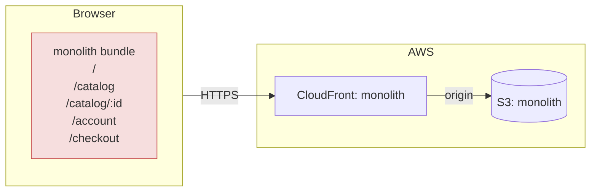
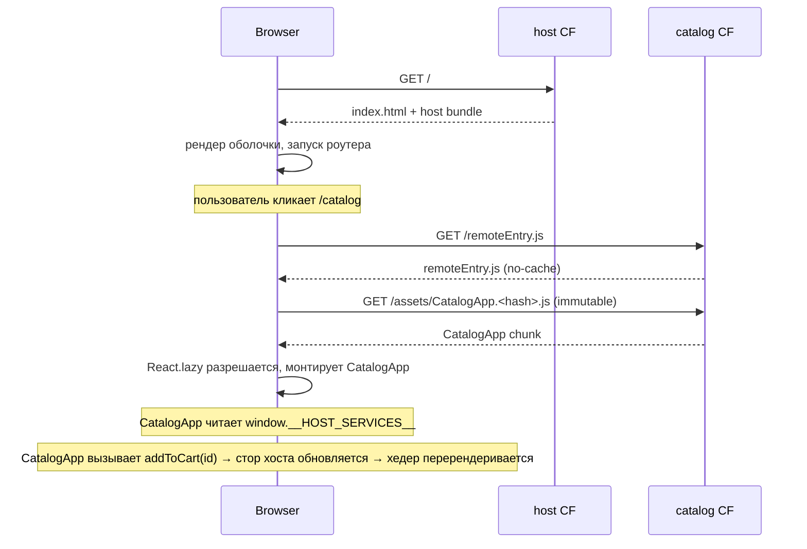
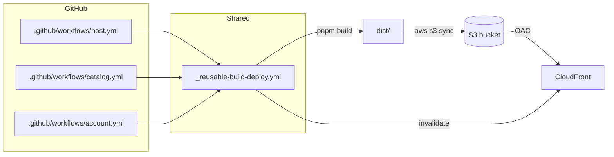

# Архитектура

Живой документ. Студенты обновляют **целевые** разделы по мере работы.

---

## Текущее состояние (монолит)

Одиночное React SPA. Один бандл, один пайплайн, одна цель деплоя.



Проблемы:

- Одна сборка на любое изменение — исправление опечатки в `Header` пересобирает всё приложение.
- Один деплой — хотфикс каталога отправляет в продакшен наполовину законченный эксперимент аккаунта.
- Единая поверхность владения — три команды редактируют один и тот же `Header.tsx`.
- Внутренняя связанность (`ProductCard` напрямую мутирует стор корзины) делает
  извлечение любого домена болезненным.

---

## Целевое состояние (микрофронтенды через Module Federation)

Три независимых бандла. Хост загружает удаленные модули во время выполнения.

```mermaid
flowchart TB
  subgraph Browser
    H[host bundle<br/>shell + router + cart + checkout]
    H -. fetch remoteEntry.js .-> C[catalog remote<br/>CatalogApp]
    H -. fetch remoteEntry.js .-> A[account remote<br/>AccountApp]
    H -. reads .-> W[[window.__HOST_SERVICES__]]
    C -. reads .-> W
    A -. reads .-> W
  end

  subgraph AWS
    direction LR
    subgraph HostSite
      HS[(S3: host)]
      HCF[CloudFront: host]
    end
    subgraph CatalogSite
      CS[(S3: catalog)]
      CCF[CloudFront: catalog]
    end
    subgraph AccountSite
      AS[(S3: account)]
      ACF[CloudFront: account]
    end
  end

  Browser --https--> HCF --> HS
  Browser --https--> CCF --> CS
  Browser --https--> ACF --> AS

  style H fill:#d6e4ff,stroke:#2b5cff
  style C fill:#dcefe3,stroke:#2c9f5a
  style A fill:#fdeccd,stroke:#c78200
```

Ключевые свойства:

- **Host (Хост)** — единственный источник, на который переходит пользователь. Он отдает `index.html`
  и JS оболочки; затем браузер запрашивает `remoteEntry.js` каждого удаленного модуля
  по требованию.
- **Remotes (Удаленные модули)** — приватные домены, которые вызывает только хост. Им нужен
  заголовок `Access-Control-Allow-Origin`, чтобы разрешить это.
- **Routing (Роутинг)** полностью на стороне клиента (react-router): `/catalog/*` монтирует
  удаленный модуль каталога, `/account/*` монтирует удаленный модуль аккаунта. Хост
  не проксирует — он компонует.
- **Независимый CI.** У каждого приложения свой пайплайн, и оно деплоит только свой
  бакет и дистрибуцию.

---

## Последовательность загрузки



---

## Контракты

### `HostServices` (хост → удаленные модули)

Определено в `packages/types/src/index.ts`. Инжектируется хостом в
`window.__HOST_SERVICES__` перед монтированием любого удаленного модуля. Читается модулями через
`getHostServices()`.

```ts
interface HostServices {
  session: {
    user: { id; email; name; tier } | null;
    isAuthenticated: boolean;
  };
  addToCart: (productId: string, quantity?: number) => void;
  cartCount: number;
}
```

**Правило версионирования:** только дополнение (additive-only). Удаление или сужение поля — это
ломающее изменение, которое должно координироваться между всеми деплоями (сначала деплоим модули,
затем хост — или вводим новое поле и удаляем старое в
следующем релизе).

### Контракт роутинга (хост → удаленные модули)

- Хост владеет: `/`, `/checkout`, всем, что не совпадает с префиксом удаленного модуля.
- `/catalog/*` делегируется приложению `CatalogApp` каталога. Его внутренние роуты
  используют *относительные* пути.
- `/account/*` делегируется приложению `AccountApp` аккаунта.
- Удаленные модули никогда не должны рендерить `<a href="/">` с абсолютным путем, который
  выходит за их точку монтирования без прохождения через роутер хоста.

### Владение данными

| Данные         | Владелец | Обоснование                                      |
|----------------|----------|--------------------------------------------------|
| Сессия/Юзер    | хост     | Единый источник истины, зеркалируется в модули.  |
| Корзина        | хост     | Агрегирует данные из разных модулей; живет там же, где Checkout. |
| Товары         | каталог  | Домен каталога.                                  |
| Заказы         | аккаунт  | Домен аккаунта.                                  |
| Фичи-флаги     | хост     | Единый источник; пробрасывается в модули через `HostServices`. |

Импорт данных между удаленными модулями запрещен. Если Аккаунту нужно название
товара для рендера строки заказа, то либо:
- Аккаунт сохраняет денормализованный снимок данных в момент создания заказа, либо
- хост предоставляет функцию `lookupProduct(id)` через `HostServices`.

Предпочтительно: первое. Денормализация строки заказа дешева и избавляет от
связанности.

---

## Топология деплоя



---

## Политика кэширования

| Путь                    | Cache-Control                             | Почему                           |
|-------------------------|-------------------------------------------|----------------------------------|
| `/index.html`           | `no-cache`                                | Должен всегда видеть свежие URL  |
| `/remoteEntry.js`       | `no-cache`                                | Должен всегда видеть свежие чанки|
| `/assets/*.[hash].js`   | `public, max-age=31536000, immutable`     | Хэш гарантирует уникальность     |
| `/img/*.svg`            | `public, max-age=31536000, immutable`     | Статические ассеты               |

---

## CORS

Хост находится на одном домене CloudFront; каждый удаленный модуль — на другом.
Браузер хоста откажется выполнять `remoteEntry.js` из другого источника,
если этот источник не пришлет `Access-Control-Allow-Origin`. В разработке мы ставим `*`;
в продакшене ограничиваем только доменом хоста.

---

## Режимы отказа (Failure modes)

| Отказ                            | Радиус поражения               | Обнаружение                     | Восстановление                   |
|----------------------------------|--------------------------------|---------------------------------|----------------------------------|
| Catalog `remoteEntry.js` 404     | Только `/catalog/*`            | Fallback в `RemoteBoundary`     | Откат каталога                   |
| Несовпадение чанков (старый JS)  | Юзеры в процессе загрузки      | Ошибки в консоли, отчеты юзеров | Исправляется `no-cache` на Entry |
| Конфликт версий React            | Весь сайт, хуки ломаются       | "Invalid hook call" в консоли   | Закрепить версию, пересобрать    |
| Хост недоступен                  | Весь сайт                      | Pingdom на домене хоста         | Откат хоста                      |
| Ломающее изменение в `@mf/types` | Ошибки типов или рантайма      | CI ловит типы; рантайм ошибки   | Правило дополнения; фичи-флаги   |

---

## Стратегия отката (Rollback strategy)

Если сломанный билд попал в продакшен, у нас есть два механизма отката.
Оба полагаются на ключевое свойство нашего пайплайна: **двухфазный sync**
(см. `_reusable-build-deploy.yml`).

### Двухфазный sync (почему важен порядок)

```text
Фаза 1 — загрузка хэшированных чанков
  aws s3 sync ... --exclude "index.html" --exclude "remoteEntry.js"
                  --cache-control "public, max-age=31536000, immutable"

Фаза 2 — загрузка файлов входа
  aws s3 sync ... --include "index.html" --include "remoteEntry.js"
                  --cache-control "no-cache"
```

Новые чанки (с новым хэшем в имени) загружаются **до** того, как
`index.html` начнет на них ссылаться. Это означает:

- Пользователь, открывший сайт **до** деплоя, видит старый `index.html` →
  загружает старые чанки (они все еще есть в бакете).
- Пользователь, открывший сайт **после** деплоя, видит новый `index.html` →
  загружает новые чанки (они уже были загружены на Фазе 1).
- Окно состояния гонки, где может возникнуть 404 (старый `index.html` +
  отсутствующие чанки), практически равно нулю.

### Механизм 1: Перезапуск Git SHA (стандартный)

1. Перейдите в **GitHub Actions → workflow → Run workflow**.
2. Выберите ветку или SHA коммита, представляющий последнее рабочее состояние.
3. Пайплайн пересобирает код из этого SHA (детерминированная сборка).
4. Фаза 1 повторно загружает "старые" чанки в S3.
5. Фаза 2 перезаписывает `index.html` / `remoteEntry.js` предыдущими версиями.
6. Инвалидация CloudFront (`/index.html`, `/remoteEntry.js`, `/`) сбрасывает
   кэш во всех edge локациях.
7. Следующий запрос пользователя получает восстановленную версию.

**Время отката:** ~2–3 минуты (сборка + синхронизация + распространение инвалидации).

### Механизм 2: Версионирование S3 (аварийный, без пересборки)

Terraform включает `versioning` на каждом бакете
(`infra/modules/static-site/main.tf`, ресурс `aws_s3_bucket_versioning`).
Это означает, что S3 хранит **все предыдущие версии** каждого объекта.

Аварийный откат без CI/CD:

```bash
# 1. Найдите version-id предыдущего index.html
aws s3api list-object-versions \
  --bucket mf-sandbox-catalog-dev \
  --prefix index.html \
  --max-keys 5

# 2. Восстановите конкретную версию (скопируйте ее поверх текущей)
aws s3api copy-object \
  --bucket mf-sandbox-catalog-dev \
  --copy-source "mf-sandbox-catalog-dev/index.html?versionId=<PREV_VERSION_ID>" \
  --key index.html \
  --cache-control "no-cache"

# 3. Инвалидация кэша CloudFront
aws cloudfront create-invalidation \
  --distribution-id E3NTDORYTZ7T7Q \
  --paths "/index.html" "/remoteEntry.js" "/"
```

**Время отката:** ~30 секунд + распространение инвалидации. Не требует
пересборки и доступа к GitHub. Идеально для критических инцидентов.

### Почему `aws s3 sync --delete` безопасен

Флаг `--delete` удаляет из бакета файлы, которых нет в текущей сборке
(т.е. старые чанки). Это безопасно по двум причинам:

1. Хэшированные чанки уникальны — новая сборка создает файлы с новыми хэшами.
   Старые чанки больше не нужны, как только обновляется `index.html`.
2. Если пользователь застрял на старом `index.html` и запрашивает удаленный чанк,
   `RemoteBoundary` (Error Boundary) ловит ошибку 404 и показывает
   запасной UI вместо белого экрана.

---

## Обнаружение сервисов (Динамические удаленные модули)

### Текущая реализация (статическая)

В данный момент хост обнаруживает URL удаленных модулей через переменные
окружения, которые Webpack запекает в бандл во время сборки:

```js
// webpack.config.ts (host)
new ModuleFederationPlugin({
  remotes: {
    catalog: `catalog@${process.env.CATALOG_URL}/remoteEntry.js`,
    account: `account@${process.env.ACCOUNT_URL}/remoteEntry.js`,
  },
})
```

Переменные `CATALOG_URL` и `ACCOUNT_URL` берутся из GitHub Variables
(`vars.CATALOG_URL_DEV`) и внедряются во время шага `pnpm build` в CI.

**Проблема:** Если мы хотим изменить домен каталога (например, перенести на
другой дистрибутив CloudFront или в другой регион), мы должны:

1. Обновить переменную GitHub.
2. Пересобрать и передеплоить **хост**, даже если его код не изменился.

Это нарушает принцип независимого развертывания.

### Целевая архитектура (динамическая)

Вместо статического внедрения при сборке, хост должен обнаруживать адреса
удаленных модулей **при каждой загрузке страницы**:

```text
Браузер → GET /config/remotes.json → { catalog: "https://d3ek...net", account: "https://d2zd...net" }
       → GET catalog_url/remoteEntry.js
       → монтирование CatalogApp
```

#### Шаг 1: Манифест

Создайте JSON-файл `remotes.json` и сохраните его в специальном S3 бакете
(или в SSM Parameter Store):

```json
{
  "catalog": {
    "url": "https://d3ekdye2vts754.cloudfront.net",
    "module": "./CatalogApp"
  },
  "account": {
    "url": "https://d2zdr2f6y6od3k.cloudfront.net",
    "module": "./AccountApp"
  }
}
```

#### Шаг 2: Динамическая загрузка

Хост запрашивает манифест **перед** тем, как React начнет рендер:

```ts
// src/lib/dynamic-remotes.ts
export async function loadRemoteManifest(): Promise<RemoteManifest> {
  const res = await fetch("/config/remotes.json");
  return res.json();
}

export async function loadRemoteModule(
  manifest: RemoteManifest,
  remoteName: string
) {
  const entry = manifest[remoteName];

  // Динамическая инициализация и загрузка remoteEntry.js
  await __webpack_init_sharing__("default");
  const container = await import(/* webpackIgnore: true */ `${entry.url}/remoteEntry.js`);
  await container.init(__webpack_share_scopes__.default);

  // Извлечение запрошенного модуля
  const factory = await container.get(entry.module);
  return factory();
}
```

#### Шаг 3: Обновление без передеплоя хоста

Чтобы изменить домен каталога, просто обновите манифест:

```bash
aws ssm put-parameter --name "/mf/dev/catalog-url" \
  --value "https://new-catalog-domain.cloudfront.net" --overwrite
```

Хост прочитает новый адрес при следующей загрузке страницы. Код хоста
не менялся, пайплайн хоста не запускался.

---

## Что бы я сделал иначе в реальной компании на 50 разработчиков

В сценарии масштабирования до 50+ разработчиков в 8–10 командах текущая
настройка монорепозитория и Module Federation столкнется с узкими местами.
Ниже приведен подробный разбор того, что бы я изменил и почему.

### 1. Тестирование контрактов и типизация

**Проблема:** Сегодня мы делим папку `packages/types` внутри монорепозитория.
Любой разработчик может отредактировать `HostServices`, запушить в `main` и
случайно сломать каждый модуль, который зависит от старой формы — без
предупреждения при компиляции для уже развернутых модулей.

**Решение:**

- Публиковать `@mf/types` во **внутренний реестр npm** (например, GitHub Packages
  или AWS CodeArtifact) со строгим **семантическим версионированием**.
- Внедрить **тестирование контрактов**, используя [Pact](https://pact.io/) или аналоги.
  Каждый модуль пишет «контракт потребителя», описывающий форму `HostServices`,
  которую он ожидает. CI хоста проверяет все контракты перед слиянием.
- Соблюдать **правило "только дополнение"** на уровне CI: линтер или скрипт,
  который сравнивает текущий интерфейс с предыдущей опубликованной версией
  и запрещает удаления или сужения типов.

```text
CI модуля (потребитель):
  1. Генерация контракта Pact на основе использования HostServices
  2. Публикация контракта в Pact Broker

CI хоста (поставщик):
  1. Получение всех контрактов из Pact Broker
  2. Проверка соответствия реализации хоста каждому контракту
  3. Блокировка мерджа при нарушении контракта
```

### 2. Стратегия общей библиотеки UI

**Проблема:** Вынос компонентов в `@mf/ui` и ожидание дедупликации в рантайме
через Module Federation — это хрупко. Ошибка версии в общей кнопке может
вызвать тонкие баги рендеринга, невидимые до продакшена.

**Решение:**

- Оформить дизайн-систему как **стандартный npm-модуль** (`@acme/design-system`),
  версионируемый независимо со своим CI-пайплайном.
- Каждый микрофронтенд **закрепляет конкретную версию** в `package.json` и
  бандлит свою копию. Это исключает конфликты версий в рантайме.
- Использовать **визуальное регрессионное тестирование** (например, Chromatic
  или Percy) в CI дизайн-системы, чтобы отлавливать изменения до публикации.
- Принять **стратегию плавного обновления**: когда выходит новая версия системы,
  команды обновляются в своем темпе. Хост и модули могут временно работать на
  разных версиях без поломок, пока изменения обратно совместимы.

### 3. Динамические модули и Canary-деплои

**Проблема:** Сейчас URL-адреса модулей "зашиты" в хост при сборке. Деплой
новой версии модуля происходит сразу на всех — 100% юзеров мгновенно получают
новый код. Если он сломан, страдают все.

**Решение:**

- Реализовать подход с **манифестом времени выполнения**, описанный выше.
- Интегрировать с **сервисом фича-флагов** (LaunchDarkly, AWS AppConfig или
  простой JSON в S3) для управления тем, какая версия модуля отдается юзерам.
- Поддерживать **canary-деплои**: направлять 5–10% трафика на `catalog-v2`,
  пока 90–95% видят `catalog-v1`. Мониторить ошибки и метрики. Если все
  хорошо, постепенно увеличивать до 100%.

```text
remotes.json (пример canary):
{
  "catalog": {
    "stable": "https://catalog-v1.cloudfront.net",
    "canary": "https://catalog-v2.cloudfront.net",
    "canaryPercent": 10
  }
}

Логика хоста:
  if (Math.random() * 100 < manifest.catalog.canaryPercent) {
    load(manifest.catalog.canary);
  } else {
    load(manifest.catalog.stable);
  }
```

### 4. Наблюдаемость и отслеживание ошибок

**Проблема:** В текущей схеме, если модуль ломается «тихо» (например, рендерит
неверные данные, но не падает), мы не можем это обнаружить. `RemoteBoundary`
ловит только фатальные ошибки, а не логические.

**Решение:**

- Интегрировать **централизованный сервис отслеживания ошибок** (Sentry, Datadog RUM)
  в хост и каждый модуль.
- Помечать каждую ошибку тегами `remote_name`, `remote_version` (SHA) и
  `host_version`, чтобы быстро понять, чей деплой вызвал регрессию.
- Настроить **синтетический мониторинг** (Datadog Synthetics), который каждые
  5 минут проходит по всему пути пользователя и оповещает о сбоях.
- Отслеживать **Web Vitals** (LCP, FID, CLS) для каждого модуля. Если LCP модуля
  каталога падает после деплоя, команда каталога получает алерт.

### 5. Команда платформы и управление

**Проблема:** При 50 разработчиках нет одного человека, который понимал бы
весь деплой, модули Terraform, конфиги Module Federation и общие пакеты.
Возникают «информационные колодцы», и команды принимают разные решения.

**Решение:**

- Создать **команду Platform/DX** (2–3 инженера), ответственную за:
  - Многоразовые CI/CD воркфлоу (`_reusable-build-deploy.yml`)
  - Модули Terraform (`infra/modules/*`)
  - Общие пакеты (`@mf/types`, `@mf/config`)
  - Инструменты разработки (локальный запуск, `pnpm dev:all`)
- Создавать **ADR (Architecture Decision Records)** для каждого важного
  решения (например, «Почему MF вместо iframe»). Хранить их в `docs/adr/`,
  чтобы новички понимали контекст.
- Внедрить **процесс RFC** для изменений, пересекающих границы команд
  (например, добавление поля в `HostServices`).

### 6. Репозиторий и топология команд

**Проблема:** Один монорепозиторий на 50 человек создает конфликты мерджа,
длинные очереди CI и социальное трение. Но разделение на 10 репо создает
ад управления зависимостями.

**Решение:** Гибридный подход.

- Оставить **хост** и **общие пакеты** в монорепозитории (они меняются редко
  и влияют на всех).
- Выносить каждый **модуль** в свой репозиторий, когда в команде станет 5+
  человек. Свой CI, свой цикл релизов, свой `package.json`, зависящий от
  опубликованного `@mf/types`.
- Использовать **Turborepo** или **Nx** для монорепо, чтобы обеспечить
  инкрементальные сборки и запуск CI только для затронутого кода.
- Сопоставить команды и модули 1:1, следуя **Inverse Conway Maneuver**:
  структурировать код так, чтобы он соответствовал желаемой схеме общения команд.
